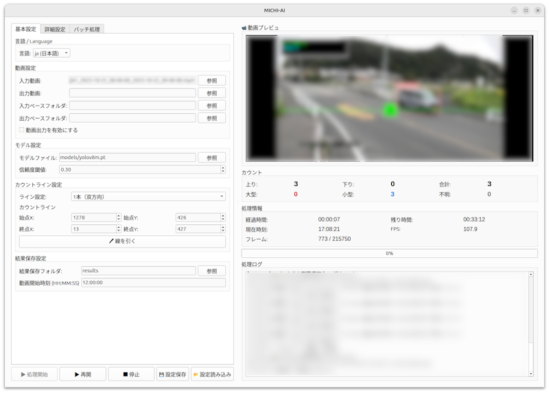

# MICHI-AI

📄 日本語版READMEはこちら →[README_ja.md](README.ja.md)

Traffic surveys are still labor-intensive and difficult to reproduce.
MICHI-AI is a research project that explores how AI can assist
traffic volume analysis workflows.

## Overview



## Features

- Vehicle detection using YOLOv8
- Tracking and passing counting using ByteTrack
- Aggregation by time period / vehicle type
- CSV / JSON output
- Image saving (optional)
- GPU / TensorRT support (optional)

## System Requirements
The following are the confirmed requirements. It may work on other environments.
- Python 3.10+
- OS: Linux / Windows
- GPU: NVIDIA GPU + CUDA

## Installation

```bash
pip install -r requirements.txt
```

When using a GPU (CUDA 11.8 example):

```bash
pip install torch torchvision --index-url https://download.pytorch.org/whl/cu118
```

## Folder Preparation

```bash
python setup_folders.py
```

## Downloading a YOLOv8 Model

Download any YOLOv8 model from the [Ultralytics official site](https://docs.ultralytics.com/models/yolov8/) and place it in the `models/` folder.

Available models:
- `yolov8n.pt` (lightest)
- `yolov8s.pt`
- `yolov8m.pt` (recommended)
- `yolov8l.pt`
- `yolov8x.pt` (highest accuracy)

## Usage (GUI)

```bash
python main_gui.py
```

### What you can do with the GUI

- Selecting input video
- Specifying output destination
- Setting the count line
- Configuring GPU/TensorRT/batch inference
- Enabling vehicle classification

## Configuration

The main configuration is done in `config.json`, which can be edited from the GUI.

Example (excerpt):

```json
{ 
"model": { 
"model_file": "models/yolov8m.pt", 
"confidence_threshold": 0.3, 
"iou_threshold": 0.4, 
"image_size": 320 
}, 
"performance": { 
"use_gpu": true, 
"use_tensorrt": false, 
"use_batch_inference": false, 
"batch_size": 4, 
"frame_skip": 0 
}, 
"lines": { 
"mode": "dual", 
"up_line": {"start_x": 100, "start_y": 200, "end_x": 1400, "end_y": 200}, 
"down_line": {"start_x": 100, "start_y": 300, "end_x": 1400, "end_y": 300}
}
}
```

## Output

- Outputs CSV/JSON to `results/`
- Saves vehicle images under `vehicle_images/` if vehicle image saving is enabled

## Modules

- `main_gui.py`: GUI entry
- `video_processor.py`: Processing pipeline
- `video_processing/`: Separate processing modules
- `writer.py`: Asynchronous video output
- `image_saver.py`: Vehicle image saving
- `counts.py`: Time zone/vehicle type count
- `recognition.py`: Recognition result management
- `detection.py`: Detection/tracking settings
- `exporter.py`: CSV/JSON output

## Third-Party Libraries

MICHI-AI depends on the following third-party open-source libraries:

- PyTorch (torch, torchvision)  
  License: BSD-style License  
  https://pytorch.org/

- OpenCV (opencv-python)  
  License: Apache License 2.0  
  https://opencv.org/

- Ultralytics YOLOv8 (ultralytics)  
  License: AGPL-3.0  
  https://github.com/ultralytics/ultralytics

- Supervision  
  License: MIT License  
  https://github.com/roboflow/supervision

- Pillow  
  License: MIT-CMU License  
  https://python-pillow.github.io

- NumPy  
  License: BSD License  
  https://numpy.org/

- PySide6 (Qt for Python)  
  License: LGPL-3.0  
  https://www.qt.io/qt-for-python

- tqdm  
  License: MIT License  
  https://github.com/tqdm/tqdm

Optional components:

- NVIDIA TensorRT  
  License: NVIDIA Proprietary License  
  https://developer.nvidia.com/tensorrt

Each third-party library is subject to its own license.
Please review the respective licenses before use.

## License
This project is licensed under the GNU Affero General Public License v3.0 (AGPL-3.0).

## Disclaimer
This software is provided "as is" without warranty of any kind, express or implied.
The authors and contributors shall not be liable for any damages arising from the use of this software.
